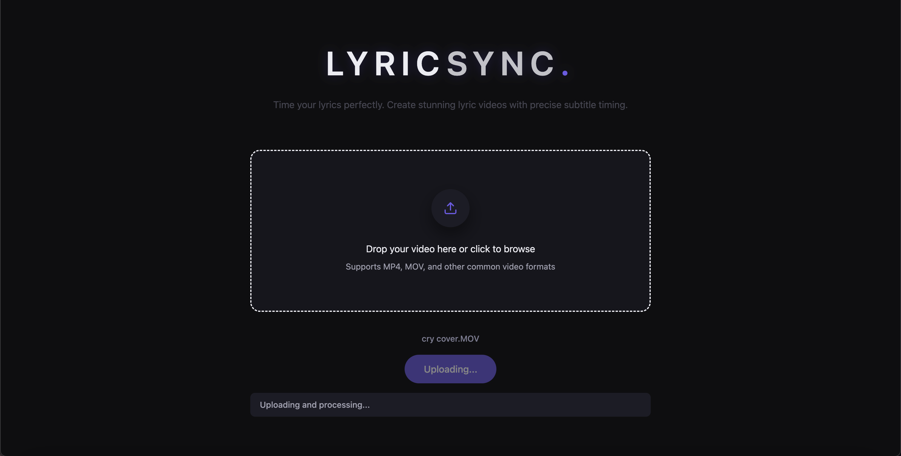

# LyricSync

A full-stack web application for automatically transcribing singing videos, synchronizing lyrics with precise timing, and rendering professional lyric videos with customizable subtitles.

## Overview

LyricSync automates the time-consuming process of creating lyric videos. Upload a singing video, and the application uses AI transcription to generate time-aligned lyrics that can be edited, styled, and burned directly into the video with professional-quality subtitles.

## Key Features

### Video Processing
- **Automatic Transcription**: AI-powered speech-to-text using Whisper for accurate lyric extraction
- **Precise Timing**: Automatic alignment of lyrics with video timestamps
- **Video Upload**: Support for multiple video formats (MP4, MOV, WebM, etc.)

### Lyric Editing
- **Real-time Preview**: Synchronized playback of video with lyrics
- **Interactive Timeline**: Edit lyrics and timing with visual feedback
- **Segment Management**: Add, edit, and delete lyric segments with precise start/end times

### Video Rendering
- **Subtitle Burning**: Render lyrics directly into video using FFmpeg
- **Customizable Styling**: Full control over font family, size, color, stroke, position, opacity, and rotation
- **Multiple Font Support**: Arial, Georgia, Helvetica, Inter, Times New Roman with bold/italic variants
- **Export Options**: Download rendered videos with burned-in subtitles

### User Experience
- **Modern UI**: Clean, responsive interface built with React and Tailwind CSS
- **Drag-and-Drop**: Intuitive file upload workflow
- **Real-time Feedback**: Live preview of styling changes before rendering

## Screenshots

### Upload Screen


### Editor Screen


## Technology Stack

### Backend
- **Framework**: FastAPI (Python 3.10+)
- **Database**: PostgreSQL with SQLAlchemy ORM
- **Transcription**: OpenAI Whisper API
- **Video Processing**: FFmpeg for subtitle rendering
- **Testing**: pytest with comprehensive integration and unit tests
- **Migrations**: Alembic for database schema management

### Frontend
- **Framework**: React 18 with TypeScript
- **Build Tool**: Vite
- **Styling**: Tailwind CSS with custom theme
- **UI Components**: Radix UI primitives with custom styling
- **State Management**: React Hooks and Context API
- **Routing**: React Router

### Infrastructure
- **Database**: PostgreSQL (production), SQLite (testing)
- **File Storage**: Local filesystem with organized directory structure
- **API Architecture**: RESTful API with dependency injection
- **Authentication**: Owner-key based access control

## Architecture

### API Endpoints

- `POST /api/transcribe` - Upload and transcribe video
- `GET /api/video/{video_id}` - Retrieve video file
- `GET /api/segments/{video_id}` - Get lyric segments for a video
- `PUT /api/segments/{video_id}` - Update lyric segments
- `POST /api/burn` - Render video with burned-in subtitles

### Database Schema

- **Videos**: Core video metadata and ownership
- **Segments**: Time-aligned lyric segments with text and timing
- **Styles**: Subtitle styling preferences per video

### Key Design Decisions

- **UUID-based Identity**: Consistent UUID usage throughout the stack for video identification
- **Database-First Segments**: Lyrics stored in database for persistence and consistency
- **Modular Service Layer**: Separated concerns for transcription, storage, rendering, and authentication
- **Comprehensive Testing**: In-memory SQLite for fast, isolated test execution

## Getting Started

### Prerequisites

- Python 3.10 or higher
- Node.js 18 or higher
- PostgreSQL (for production)
- FFmpeg (for video rendering)
- OpenAI API key (for transcription)

### Backend Setup

```bash
cd backend
python -m venv venv
source venv/bin/activate  # On Windows: venv\Scripts\activate
pip install -r requirements.txt

# Set up environment variables
cp .env.example .env
# Edit .env with your database URL and API keys

# Run database migrations
alembic upgrade head

# Start the development server
uvicorn src.main:app --reload
```

### Frontend Setup

```bash
cd frontend
npm install
npm run dev
```

### Running Tests

```bash
# Backend tests
cd backend
pytest

# Run specific test suite
pytest tests/integration/test_burn_api.py -v
```

## Project Structure

```
LyricSync/
├── backend/
│   ├── src/
│   │   ├── routes/          # API endpoint handlers
│   │   ├── services/        # Business logic layer
│   │   ├── models/          # SQLAlchemy ORM models
│   │   ├── schemas/         # Pydantic request/response models
│   │   ├── db/              # Database session management
│   │   └── utils/           # Helper utilities
│   ├── tests/               # Comprehensive test suite
│   │   ├── integration/     # API integration tests
│   │   └── unit/            # Unit tests
│   └── alembic/             # Database migrations
└── frontend/
    ├── src/
    │   ├── app/             # React application
    │   │   ├── components/  # UI components
    │   │   └── lib/         # API client and utilities
    │   └── styles/           # CSS and theme files
    └── public/              # Static assets
```

## Testing Strategy

The project includes a comprehensive test suite with:

- **Integration Tests**: Full API endpoint testing with in-memory database
- **Unit Tests**: Isolated component and utility testing
- **Golden Tests**: Visual regression testing for rendered video output
- **Test Isolation**: Each test runs with a fresh database instance

Key testing practices:
- In-memory SQLite for fast test execution
- Fixture-based test data setup
- Dependency injection for database mocking
- Comprehensive coverage of API endpoints

## Development Highlights

### Code Quality
- Type hints throughout Python codebase
- TypeScript for type-safe frontend development
- Consistent code organization and separation of concerns
- Comprehensive error handling and validation

### Performance
- Efficient database queries with proper indexing
- Optimized video processing pipeline
- Fast test execution with in-memory databases
- Responsive UI with optimized React rendering

### Security
- Owner-key based access control
- Input validation on all API endpoints
- Secure file upload handling with size limits
- SQL injection prevention via ORM

## Future Enhancements

- User authentication and multi-user support
- Cloud storage integration (S3, GCS)
- Batch processing for multiple videos
- Advanced subtitle animation effects
- Project templates and presets
- Collaborative editing features

## License

MIT License

## Contact

For questions, feedback, or contributions, please open an issue or submit a pull request.
