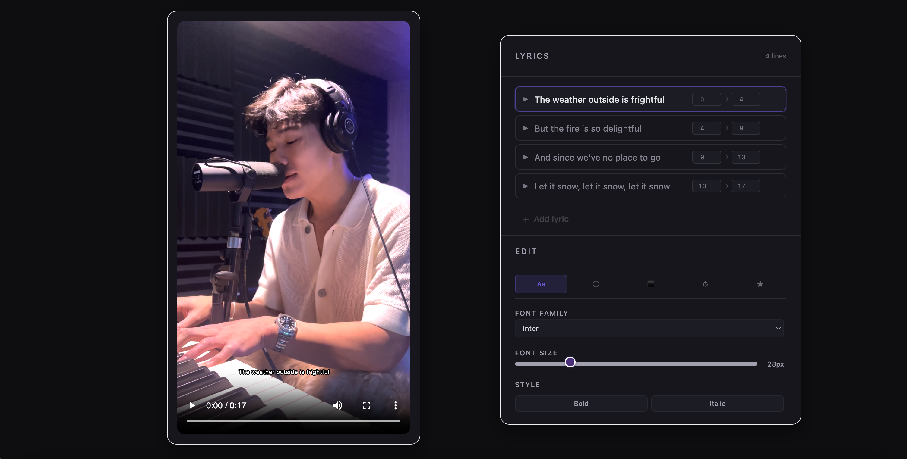
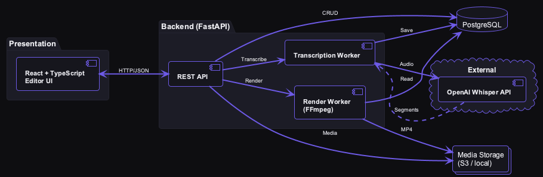

<link rel="stylesheet" href="./assets/custom.css">

<style>
/* LyricSync Theme - Dark Studio Aesthetic */
:root {
  --bg: #0E0E11;
  --panel: #16161D;
  --panel2: #1C1C26;
  --border: #242430;
  --text: #EDEDF2;
  --muted: #A0A0B0;
  --muted2: #7C7C92;
  --accent: #6D5AE6;
  --accentSoft: rgba(109, 90, 230, 0.15);
}

* {
  box-sizing: border-box;
}

body {
  background-color: var(--bg) !important;
  color: var(--text) !important;
  font-family: -apple-system, BlinkMacSystemFont, "Segoe UI", Helvetica, Arial, sans-serif;
  line-height: 1.7;
  margin: 0;
  padding: 0;
}

h1 {
  color: var(--text) !important;
  font-weight: 700;
  font-size: 2.5rem;
  margin-top: 0;
  margin-bottom: 1rem;
  line-height: 1.2;
}

h2 {
  color: var(--text) !important;
  font-weight: 600;
  font-size: 1.75rem;
  border-bottom: 2px solid var(--border);
  padding-bottom: 0.75rem;
  margin-top: 3rem;
  margin-bottom: 1.5rem;
}

h3 {
  color: var(--text) !important;
  font-weight: 600;
  font-size: 1.35rem;
  margin-top: 2rem;
  margin-bottom: 1rem;
}

h4, h5, h6 {
  color: var(--text) !important;
  font-weight: 600;
  margin-top: 1.5rem;
  margin-bottom: 0.75rem;
}

p {
  color: var(--text);
  margin: 1rem 0;
  line-height: 1.7;
}

a {
  color: var(--accent) !important;
  text-decoration: none;
  transition: opacity 0.2s ease;
}

a:hover {
  text-decoration: underline;
  opacity: 0.85;
}

ul, ol {
  color: var(--text);
  margin: 1rem 0;
  padding-left: 2rem;
}

li {
  margin: 0.5rem 0;
  line-height: 1.6;
}

code {
  background-color: var(--panel2) !important;
  color: var(--accent) !important;
  padding: 0.2em 0.5em;
  border-radius: 4px;
  font-size: 0.9em;
  border: 1px solid var(--border);
  font-family: 'Monaco', 'Menlo', 'Ubuntu Mono', monospace;
}

pre {
  background-color: var(--panel) !important;
  border: 1px solid var(--border) !important;
  border-radius: 8px;
  padding: 1.25rem;
  overflow-x: auto;
  margin: 1.5rem 0;
  color: var(--text) !important;
}

pre code {
  background-color: transparent !important;
  color: var(--text) !important;
  border: none;
  padding: 0;
  font-size: 0.9em;
}

blockquote {
  border-left: 3px solid var(--accent);
  padding-left: 1.5rem;
  margin: 1.5rem 0;
  color: var(--muted);
  background-color: var(--panel2);
  padding: 1rem 1.5rem;
  border-radius: 6px;
  font-style: italic;
}

img {
  border-radius: 10px;
  border: 1px solid var(--border);
  box-shadow: 0 8px 24px rgba(0, 0, 0, 0.4);
  max-width: 100%;
  height: auto;
  display: block;
  margin: 2rem auto;
}

hr {
  border: none;
  border-top: 1px solid var(--border);
  margin: 3rem 0;
}

.architecture-diagram {
  background-color: var(--panel);
  border: 1px solid var(--border);
  border-radius: 12px;
  padding: 2rem;
  margin: 3rem 0;
  text-align: center;
  box-shadow: 0 4px 16px rgba(0, 0, 0, 0.3);
}

.architecture-diagram img {
  border: none;
  box-shadow: none;
  max-width: 100%;
  margin: 0;
}

.screenshot-caption {
  color: var(--muted);
  font-size: 0.9rem;
  margin-top: 0.75rem;
  font-style: italic;
  text-align: center;
}

strong {
  color: var(--text);
  font-weight: 600;
}

/* Responsive design */
@media (max-width: 768px) {
  body {
    padding: 1rem;
  }
  
  h1 {
    font-size: 2rem;
  }
  
  h2 {
    font-size: 1.5rem;
  }
  
  .architecture-diagram {
    padding: 1rem;
  }
}

/* Link styling in hero section */
h1 + p a {
  font-weight: 500;
  border-bottom: 1px solid var(--accent);
}

h1 + p a:hover {
  border-bottom-color: transparent;
}

/* Override Jekyll theme defaults - Remove sidebar, full-width layout */
.wrapper {
  background-color: var(--bg) !important;
  color: var(--text) !important;
  max-width: 100% !important;
  padding: 0 !important;
}

.site-header {
  display: none !important;
}

.site-footer {
  display: none !important;
}

/* Ensure all containers use dark theme */
.main-content {
  background-color: var(--bg) !important;
  color: var(--text) !important;
  max-width: 1200px !important;
  margin: 0 auto !important;
  padding: 2rem !important;
}

/* Fix any white backgrounds from Jekyll */
.page-content {
  background-color: transparent !important;
  max-width: 100% !important;
}

/* Hide sidebar if present */
.sidebar {
  display: none !important;
}

/* Full-width content */
.content {
  width: 100% !important;
  max-width: 1200px !important;
  margin: 0 auto !important;
  padding: 2rem !important;
}

/* Table styling */
table {
  border-collapse: collapse;
  width: 100%;
  margin: 1.5rem 0;
}

table th, table td {
  border: 1px solid var(--border);
  padding: 0.75rem;
  text-align: left;
}

table th {
  background-color: var(--panel);
  color: var(--text);
  font-weight: 600;
}

table td {
  background-color: var(--panel2);
  color: var(--text);
}

/* Ensure syntax highlighting works with dark theme */
.highlight {
  background-color: var(--panel) !important;
  border: 1px solid var(--border) !important;
  border-radius: 8px;
  padding: 1rem;
  overflow-x: auto;
}

.highlight pre {
  background-color: transparent !important;
  margin: 0;
  padding: 0;
}

.highlight code {
  background-color: transparent !important;
  color: var(--text) !important;
}
</style>

# LyricSync.

**AI-assisted lyric timing and subtitle rendering for singing videos**

- Upload a singing video and get automatic, time-aligned lyrics
- Edit lyrics and timing with real-time preview
- Render professional subtitle videos with customizable styling

[GitHub Repository](https://github.com/seanowww/LyricSync)

---

## Demo

### Upload Interface


**Drag-and-drop video upload with progress tracking.** Supports multiple formats (MP4, MOV, WebM) and provides immediate feedback during upload. The interface validates file types and handles errors gracefully.

### Editor & Preview



**Real-time synchronized preview with styling controls.** The preview matches the final burned output pixel-perfectly through PlayRes probing via ffprobe—no calibration constants needed. Edit lyrics, adjust timing, and see changes instantly before rendering.

### Styling & Rendering

**Full typographic control with deterministic rendering.** Fonts are bundled and referenced via `fontsdir` in FFmpeg, ensuring consistent output across environments. Supports Arial, Georgia, Helvetica, Inter, and Times New Roman with bold/italic variants. FFmpeg-based subtitle burning with ASS format converts segments from JSON to ASS subtitles, then burns them into video with precise positioning, opacity, rotation, and stroke controls. Golden snapshot tests ensure style regression safety.

---

## Architecture

<div class="architecture-diagram">

</div>

*Diagram source: `docs/assets/architecture.puml`. Regenerate with: `plantuml docs/assets/architecture.puml -o docs/assets/`*

### Backend Components

- **FastAPI Routes**: RESTful endpoints for transcription, segment management, and video rendering
- **PostgreSQL + SQLAlchemy**: Videos, segments, and styles stored as relational data
- **JSON → ASS Conversion**: Segment data transformed to Advanced SubStation Alpha format
- **FFmpeg Pipeline**: Subtitle burning with font bundling and PlayRes matching

### Frontend Components

- **React + TypeScript**: Type-safe editor-like preview interface
- **Real-time Sync**: Video playback synchronized with lyric timeline
- **Styling Controls**: Live preview of font, color, position, opacity, rotation changes

### Testing Infrastructure

- **Integration Tests**: Full API endpoint coverage with in-memory SQLite
- **Golden Snapshot Tests**: Visual regression testing for rendered video frames
- **Test Isolation**: Per-test database instances for parallel execution

---

## Key Engineering Decisions

**Database as source of truth for segments/styles**  
Segments and styles are stored in PostgreSQL, not filesystem JSON. This ensures consistency, enables concurrent editing, and provides a foundation for future multi-user features.

**UUID identity consistency across API/DB/storage**  
A single UUID is generated per video and used consistently for database records, file paths, and API calls. This eliminates lookup mismatches and ensures data integrity.

**Font bundling + fontsdir with FFmpeg for deterministic renders**  
Fonts are packaged with the application and referenced via `-fontsdir` in FFmpeg commands. This guarantees identical rendering across development, CI, and production environments.

**PlayRes probing via ffprobe to match preview/burn scaling**  
The preview calculates scaling using the same PlayRes values that FFmpeg uses for rendering. This eliminates the need for calibration constants and ensures pixel-perfect preview accuracy.

**Snapshot testing for style regression safety**  
Golden image tests compare rendered video frames against expected outputs. This catches visual regressions in font rendering, positioning, and styling across 28+ style combinations.

**Dependency injection for test database isolation**  
`get_db` is patched at pytest configuration time (before route imports) to use in-memory SQLite. Each test gets a fresh database instance, enabling parallel execution and eliminating test interdependencies.

---

## Local Run

### Backend

```bash
cd backend
python -m venv venv
source venv/bin/activate
pip install -r requirements.txt

# Configure environment
cp .env.example .env
# Edit .env with DATABASE_URL and OPENAI_API_KEY

# Initialize database
alembic upgrade head

# Run server
uvicorn src.main:app --reload
```

### Frontend

```bash
cd frontend
npm install
npm run dev
```

### Tests

```bash
cd backend
pytest  # All tests
pytest tests/integration/test_burn_api.py -v  # Specific suite
```

For detailed setup instructions, see the [main README](../README.md).

---

## What I'd Build Next

**User authentication and multi-user support**  
Replace owner-key system with proper JWT-based auth. Enable users to manage multiple projects and share videos.

**Aspect ratio presets and templates**  
Pre-configured styling templates for common video formats (16:9, 9:16, 1:1) with optimized font sizes and positions.

**Enhanced segment CRUD UX**  
Drag-to-resize timing, bulk edit operations, and keyboard shortcuts for faster lyric editing workflows.

**Render job queue for async processing**  
Move video rendering to background jobs with progress tracking. Support batch rendering of multiple videos.

**Cloud storage integration**  
Replace local filesystem storage with S3/GCS for scalable file handling and CDN delivery of rendered videos.

---

*This documentation site is static; the backend is not deployed. For local development, follow the setup instructions above.*

